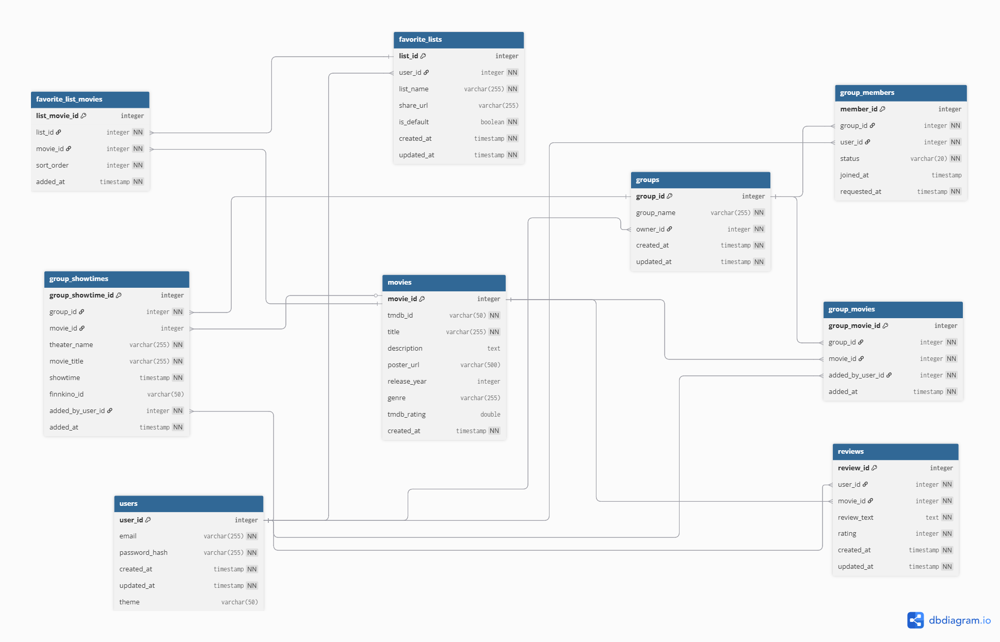

# Film Website

A movie web app where users can browse and search films, view details, and manage favorites.  
The app consists of a **Node.js/Express** backend (REST API, MySQL/MariaDB) and an **HTML/CSS/React/JavaScript** frontend.

- **Repo:** [Web-project-group-18/film_website](https://github.com/Web-project-group-18/film_website)
- **API Docs:** [Postman Documenter – Movie-App](https://documenter.getpostman.com/view/40272026/2sB3QJMq2g)



---

## Table of Contents

- [Features](#features)
- [Tech Stack](#tech-stack)
- [Architecture](#architecture)
- [Quick Start](#quick-start)
- [Environment Variables](#environment-variables)
- [Database](#database)
- [API](#api)
- [Dev Scripts](#dev-scripts)

- [Project Structure](#project-structure)
- [Testing & Quality](#testing--quality)
- [Security & Access Control](#security--access-control)
- [Deployment](#deployment)
- [Team](#team)
- [License](#license)

---

## Features

- Movie listing, search, and filtering (e.g., title/genre/year)
- Movie detail page
- Sign up & login (JWT)
- User favorites (add/remove)
- Admin role (create/update/delete movies)
- Responsive UI

## Tech Stack

- **Backend:** Node.js, Express, JWT, bcrypt, dotenv
- **Database:** MySQL/MariaDB (schema `elokuvasovellus.sql`)
- **Frontend:** HTML + CSS + JavaScript + React
- **Tooling:** ESLint/Prettier, nodemon (dev), npm scripts

## Architecture

Monorepo with separate frontend and backend:

- `frontend/` — static pages + JS that consumes the REST API
- `backend/` — Express server: authentication, movies, users, favorites
- `elokuvasovellus.sql` — database schema (tables, relations, optional seed)
- `Tietokanta.png` — database diagram (embedded above)

---

## Quick Start

### Prerequisites

- Node.js ≥ 18
- npm (or pnpm/yarn)
- MySQL 8 / MariaDB 10.5+
- (Optional) Docker Desktop

### Install

```bash
git clone https://github.com/Web-project-group-18/film_website.git
cd film_website

# Backend
cd backend
npm install
cp .env.example .env
cd ..

# Frontend
cd frontend
npm install
# (if needed) cp .env.example .env
cd ..

## Environment Variables

# Backend

# Server
PORT=3000

# Database
DATABASE_HOST=127.0.0.1
DATABASE_PORT=3306
DATABASE_NAME=elokuvasovellus
DATABASE_USER=root
DATABASE_PASSWORD=CHANGE_ME

# Auth
JWT_SECRET=please-use-a-long-random-secret
JWT_EXPIRES_IN=7d

# Frontend

REACT_APP_TMDB_KEY = yourAPIkey

## Database

# MySQL CLI
mysql -u root -p < elokuvasovellus.sql


## API

# Typical routes

Auth

POST /api/auth/register — create user

POST /api/auth/login — login, returns JWT

GET /api/auth/me — current user (Authorization: Bearer)

Movies

GET /api/movies — list; query params: search, genre, year, sort, page, limit

GET /api/movies/:id — single movie

POST /api/movies — create (admin)

PUT /api/movies/:id — update (admin)

DELETE /api/movies/:id — delete (admin)

Favorites

GET /api/users/:userId/favorites

POST /api/users/:userId/favorites — body: { "movieId": <id> }

DELETE /api/users/:userId/favorites/:movieId

- **API Docs:** [Postman Documenter – Movie-App](https://documenter.getpostman.com/view/40272026/2sB3QJMq2g)

## Dev Scripts

# Backend

npm run dev — dev server (nodemon)
npm run start — production
npm run lint — lint
npm test — tests

# Frontend

npm run dev — dev server + HMR
npm run build — production build to dist/
npm run preview — preview production build

## Project Structure

film_website/
├─ backend/              # Express: routes, controllers, services, db
│  ├─ src/
│  ├─ package.json
│  └─ .env.example
├─ frontend/             # HTML/CSS/JS + API calls
│  ├─ src/
│  ├─ package.json
│  └─ .env.example
├─ elokuvasovellus.sql
├─ Tietokanta.png
└─ README.md

## Team

Aleksi
Niko
Mikhail
Thomas